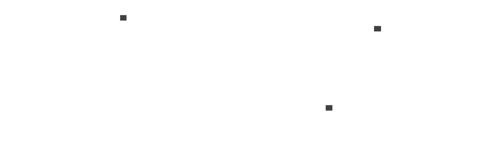

# Intro

This is a task to convert the spatial data into a tabular star schema. 

# Design 

- There is a Postgres with postGIO extension, including shp2pgsql to handle spatial data.
- Dbt to set up views for star schema.
- And the docker compose to make it easy to deliver.
- Neither orchestration, nor ETL was implemented within this project.

# Structure

- /shp/* conatins files to import into db
- /app/* contains dbt setup
- profiles.yml is a dbt connection configuration
- import.sh is the script to import files into tables
- docker-compose.yaml and Dockerfile_dbt are docker setups

# How to run

Just install docker locally and run:

```bash
docker-compose up -d
```

After successful setup you should be able to reach the database, see profiles.yml for the credentials.

In order to import files you have to execute the script:

```bash
chmod +x import.sh
./import.sh
```

Then you can deploy all dbt models:

```bash
docker exec dbt dbt run
```

# Warehouse diagram



```d2
raw.bergbaugebiete: {
  shape: sql_table
  dummy_: integer
  shape_star: float
  shape_stle: float
  geom: geometry
}

raw.gwerg: {
  shape: sql_table
  erg_id: integer
  gestein_id: integer
  bedeutung: varchar
  ergiebigke: varchar
  entn_bru: varchar
  entn_werk: varchar
  gestein: varchar
  shape_star: float
  shape_stle: float
  geom: geometry
}

raw.gwerg_erg: {
  shape: sql_table
  erg_id: integer
  bedeutung: varchar
  ergiebigke: varchar
  entn_bru: varchar
  entn_werk: varchar
  shape_star: float
  shape_stle: float
  geom: geometry
}

raw.gwerg_gestein: {
  shape: sql_table
  gestein_id: integer
  gestein: varchar
  shape_star: float
  shape_stle: float
  geom: geometry
}

raw.uferfiltrat: {
  shape: sql_table
  dummy_: integer
  shape_stle: float
  geom: geometry
}

dim.ergiebigke: {
  shape: sql_table
  erg_id: integer
  ergiebigke_name: varchar
}

dim.gestein: {
  shape: sql_table
  gestein_id: integer
  gestein_name: varchar
}

dim.shape_star: {
  shape: sql_table
  shape_star: float
}

dim.shape_stle: {
  shape: sql_table
  shape_stle: float
}

fact.bergbaugebiete: {
  shape: sql_table
  shape_star: float
  shape_stle: float
  geom: geometry
  count: integer
}

fact.gwerg: {
  shape: sql_table
  erg_id: integer
  gestein_id: integer
  shape_star: float
  shape_stle: float
  geom: geometry
  count: integer
}

fact.gwerg_erg: {
  shape: sql_table
  erg_id: integer
  shape_star: float
  shape_stle: float
  geom: geometry
}

fact.gwerg_gestein: {
  shape: sql_table
  gestein_id: integer
  shape_star: float
  shape_stle: float
  geom: geometry
  count: integer
}

fact.uferfiltrat: {
  shape: sql_table
  dummy_: integer
  shape_stle: float
  geom: geometry
  count: integer
}

dim.ergiebigke.erg_id <- fact.gwerg.erg_id
dim.ergiebigke.erg_id <- fact.gwerg_erg.erg_id

dim.gestein.gestein_id <- fact.gwerg_gestein.gestein_id
dim.gestein.gestein_id <- fact.gwerg.gestein_id

dim.shape_star.shape_star <- fact.bergbaugebiete.shape_star
dim.shape_star.shape_star <- fact.gwerg.shape_star
dim.shape_star.shape_star <- fact.gwerg_erg.shape_star
dim.shape_star.shape_star <- fact.gwerg_gestein.shape_star
dim.shape_star.shape_star <- fact.uferfiltrat.shape_star

dim.shape_stle.shape_stle <- fact.bergbaugebiete.shape_stle
dim.shape_stle.shape_stle <- fact.gwerg.shape_stle
dim.shape_stle.shape_stle <- fact.gwerg_erg.shape_stle
dim.shape_stle.shape_stle <- fact.gwerg_gestein.shape_stle
dim.shape_stle.shape_stle <- fact.uferfiltrat.shape_stle
```


